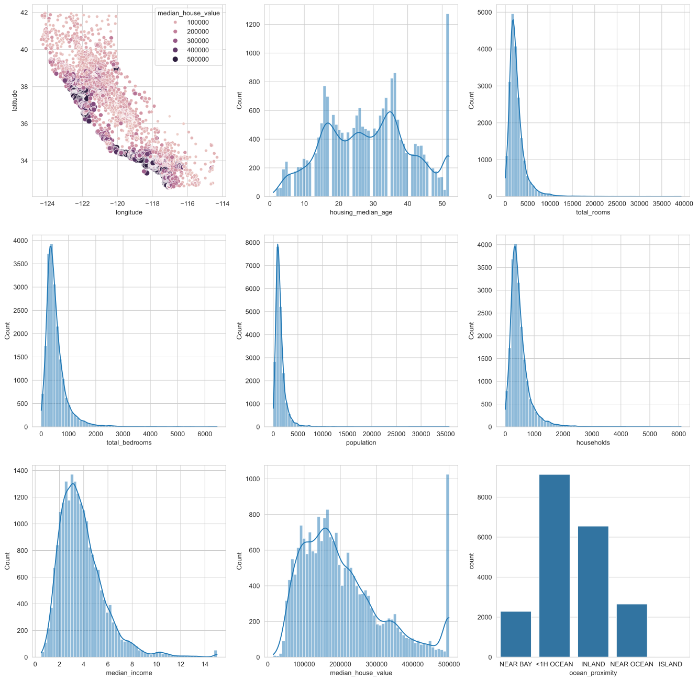

# 1.原理

## 1.1 闭式

模型：${h_\theta }(x) = {\theta ^T}X$

损失函数：$J(\theta ) = {\left\| {X\theta  - Y} \right\|_2}^2$

目标：
$$
\begin{array}{l}
\min J(\theta )\\
\theta  = \arg \min J(\theta )
\end{array}
$$
说明: 
$$
\left\{ \begin{gathered}
  \theta  \in {\mathbb{R}^{d \times 1}} \hfill \\
  X \in {\mathbb{R}^{m \times d}} \hfill \\
  Y \in {\mathbb{R}^{m \times 1}} \hfill \\ 
\end{gathered}  \right.
$$
正规方程形式求解，即为直接求$J(\theta)$的最小值：
$$
\begin{align*}
J(\theta ) &= {\left\| {X\theta  - Y} \right\|_2}^2\\
&= {(X\theta  - Y)^T}(X\theta  - Y)\\
&= ({X^T}{\theta ^T} - {Y^T})(X\theta  - Y)\\
&= {X^T}{\theta ^T}X\theta  - {Y^T}X\theta  - {Y^T}X\theta  + {Y^T}Y\\
&= {X^T}{\theta ^T}X\theta  - 2{Y^T}X\theta  + {Y^T}Y
\end{align*}
$$
对$J(\theta)$进行求导：
$$
\begin{align*}
\frac{{\partial J(\theta )}}{{\partial \theta }} &= \frac{{\partial {X^T}{\theta ^T}X\theta  - 2{Y^T}X\theta  + {Y^T}Y}}{{\partial \theta }} \\ 
&= 2{X^T}X\theta  - 2{Y^T}X \\ 
\end{align*}
$$
令$J(\theta)=0$得：
$$
\begin{align*}
2{X^T}X\theta  - 2{Y^T}X &= 0 \\ 
{X^T}X\theta  &= {Y^T}X \\ 
\theta  &= {({X^T}X)^{ - 1}}{Y^T}X \\ 
\end{align*}
$$
上述结果即为求解结果，需要说明的是：特征矩阵𝑿不满秩（即存在特征间的线性相关性），则正规方程求解过程中的矩阵求逆操作可能会导致数值不稳定性。

## 1.2 梯度下降

模型：$\[{h_\theta }(x) = \sum\limits_{i = 1}^d {{\theta _i}{x_i}} \]$

损失函数：$J(\theta ) = \frac{1}{{2m}}{\sum\limits_{j = 0}^m {\left( {{y^j} - {h_\theta }({x^j})} \right)} ^2}$

目标：
$$
\begin{array}{l}
\min J(\theta )\\
\theta  = \arg \min J(\theta )
\end{array}
$$
说明：
$$
\left\{ \begin{gathered}
  \theta  \in {\mathbb{R}^d} \hfill \\
  x \in {\mathbb{R}^d} \hfill \\
  y \in {\mathbb{R}^m} \hfill \\ 
\end{gathered}  \right.
$$


# 2.Python实现

## 2.0 导包

```python
# 导入所需的包
import numpy as np
import pandas as pd
import matplotlib.pyplot as plt
import seaborn as sns
from sklearn.impute import SimpleImputer
from sklearn.preprocessing import OneHotEncoder
from sklearn.model_selection import train_test_split
import time

%matplotlib inline
%config InlineBackend.figure_format = 'svg'
```

## 2.1 读取数据集

```python
# 读取数据
df = pd.read_csv("./housing.csv")
# 预览数据
print(df.head())

print(df.info())
```

## 2.2 数据探索

### 2.2.1 数据分布情况

```python
i = 2
fig, ax = plt.subplots(3, 3, figsize=(18, 18))

# 散点图看看价格/房子分布
sns.scatterplot(data=df, x="longitude", y="latitude", size="median_house_value", hue="median_house_value", ax=ax[0][0])

# 直方图，正态否？
for col in df.columns:
    if col == "longitude" or col == "latitude" or col == "ocean_proximity":
        continue
    sns.histplot(data=df[col], bins=60, kde=True, ax=ax[(i - 1) // 3][(i - 1) % 3])
    i = i + 1

# 分类变量
sns.countplot(data=df,x="ocean_proximity",ax=ax[2][2])
```

### 2.2.2 数据之间关系

```python
# 距海远近 VS 房龄
sns.displot(data=df,x="housing_median_age",hue="ocean_proximity",kind="kde")

# housing_median_age描述性统计
df.groupby('ocean_proximity')['housing_median_age'].describe()


# 距海远近 VS 价格
sns.displot(data=df,x="housing_median_age",hue="ocean_proximity",kind="kde")

# median_house_value描述性统计
df.groupby('ocean_proximity')['median_house_value'].describe()


# 连续型 VS 连续型
sns.pairplot(data=df.select_dtypes(include='float64'), kind='reg', diag_kind='hist')
plt.savefig("1.png")


# 计算变量之间的相关系数,皮尔逊相关系数展示线性相关关系
df_corr = df.select_dtypes(include='float64').corr()
df_corr

# 绘制热力图
sns.heatmap(df_corr, cmap="Blues")
```

## 2.3 数据预处理

```python
# 1）处理缺失值
# 取出有缺失值的列
# reshape是为了适应sklearn要求
total_bedrooms = df.loc[:, "total_bedrooms"].values.reshape(-1, 1)  

# 复制一份不破坏原数据
filled_df = df.copy()  

# 中位数填补
filled_df.loc[:, "total_bedrooms"] = SimpleImputer(strategy="median").fit_transform(total_bedrooms)  

# 看一下效果
filled_df.info()


# 2）编码
# 编码
code = OneHotEncoder().fit_transform(filled_df.loc[:, "ocean_proximity"].values.reshape(-1, 1))

# 合并
coded_df = pd.concat([filled_df, pd.DataFrame(code.toarray())], axis=1)

# 删除原列
coded_df.drop(["ocean_proximity"], axis=1, inplace=True)

# 改下表头
coded_df.columns = list(coded_df.columns[:-5]) + ["ocean_0", "ocean_1", "ocean_2", "ocean_3", "ocean_4"]
# coded_df.columns = coded_df.columns.astype(str)

# 看看效果
coded_df.head(10)
```

## 2.4 划分数据集

```python
feature = coded_df.iloc[:, :8].join(coded_df.iloc[:, -5:])
label = coded_df["median_house_value"]

Xtrain,Xtest,Ytrain,Ytest = train_test_split(feature,label,test_size=0.3)

Xtrain.head()
```

## 2.5 求解模型

### 2.5.0 评价指标R^2

```python
# 计算R^2
def R2(y, y_pred):
    return 1 - (np.sum((y - y_pred) ** 2) / np.sum((y - np.mean(y)) ** 2))
```

### 2.5.1 数据标准化

```python
# 数据标准化
def normalize(X):
    sigma = np.std(X, axis=0)
    mu = np.mean(X, axis=0)
    X = (X - mu) / sigma
    return np.array(X)

X = np.array(Xtrain).reshape(np.size(Xtrain, 0), -1)
y = np.array(Ytrain).T.reshape(-1, 1)

# 标准化（闭式求解其实不需要，但梯度下降需要，为了对比统一都采用归一化）
X = normalize(X)
y = normalize(y)
```

### 2.5.2 闭合形式求解

```python
# 1）线性回归模型的闭合形式参数求解
# 正规方程求解
def Normal_Equation(X, y):
    return np.linalg.inv(X.T @ X) @ X.T @ y

start_time = time.time()
theta_ne = Normal_Equation(X, y)

print(f"花费时间：{time.time() - start_time}")v
print(f"R^2：{R2(y, X @ theta_ne)}")

# 创建 DataFrame
result_cf = pd.DataFrame({"ColumnName": list(Xtrain.columns), "Theta": theta_ne.flatten()})
result_cf
```

### 2.5.3 梯度下降求解

```python
# 2）线性回归梯度下降参数求解
# 损失函数
def MSE_Loss(y, y_pred):
    return np.sum((y_pred - y) ** 2) / (2 * np.size(y))

# 梯度下降
def GD(X, y, lr=0.01, epochs=5000):
    m, n = X.shape

    # 初始化参数为标准正态分布
    theta = np.random.randn(n, 1)
    # 记录每代损失
    loss = np.zeros(epochs)

    for epoch in range(epochs):
        # 计算梯度
        gradient = (1 / m) * (X.T @ (X @ theta - y))
        # 更新参数
        theta -= lr * gradient
        # 记录损失
        loss[epoch] = MSE_Loss(y, X @ theta)

    return theta, loss

start_time = time.time()
[theta_gd, loss] = GD(X, y)

print(f"花费时间：{time.time() - start_time}")
print(f"R^2：{R2(y, X @ theta_gd)}")

# 创建 DataFrame
result_gd = pd.DataFrame({"ColumnName": list(Xtrain.columns), "Theta": theta_gd.flatten()})
result_gd

# 绘制损失函数梯度下降曲线
sns.lineplot(x=np.arange(5000), y=loss.flatten(), label='Loss Curve')

plt.xlabel('Epoch')
plt.ylabel('Loss')
plt.title('Gradient Descent Loss Curve')
```

# 3.实验结果

## 3.1 探索数据特征



## 3.2 求解结果展示


